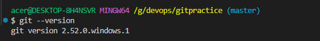
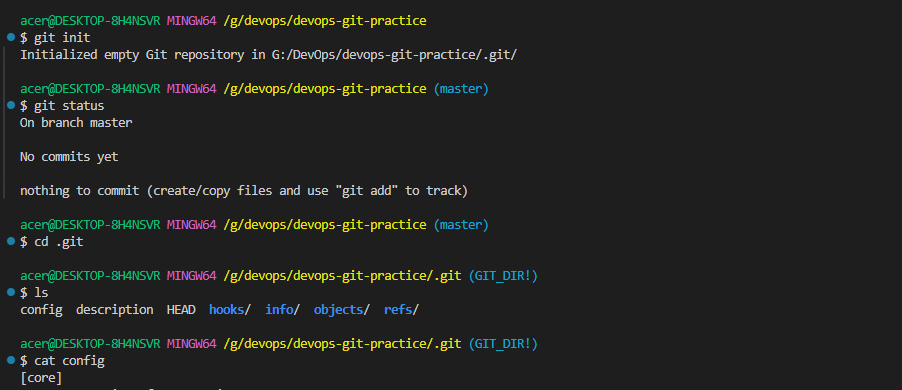

# Day 22 – Introduction to Git: Your First Repository

## Challenge Tasks

### Task 1: Install and Configure Git
1. Verify Git is installed on your machine  
## Run command -> git --version  

2. Set up your Git identity — name and email  
## Run command -> git config --global user.name "abhishekverma510"  
## Run command -> git config --global user.email "useremail"
3. Verify your configuration
## Run command -> git config --list

### Task 2: Create Your Git Project
1. Create a new folder called `devops-git-practice`
2. Initialize it as a Git repository
3. Check the status — read and understand what Git is telling you
4. Explore the hidden `.git/` directory — look at what's inside  
  
---  

### Task 3: Create Your Git Commands Reference
1. Create a file called `git-commands.md` inside the repo
2. Add the Git commands you've used so far, organized by category:
   - **Setup & Config**
   - **Basic Workflow**
   - **Viewing Changes**
3. For each command, write:
   - What it does (1 line)
   - An example of how to use it

---

### Task 4: Stage and Commit
1. Stage your file
2. Check what's staged
3. Commit with a meaningful message
4. View your commit history

### Task 5: Make More Changes and Build History
1. Edit `git-commands.md` — add more commands as you discover them
2. Check what changed since your last commit
3. Stage and commit again with a different, descriptive message
4. Repeat this process at least **3 times** so you have multiple commits in your history
5. View the full history in a compact format

### Task 6: Understand the Git Workflow
Answer these questions in your own words (add them to a `day-22-notes.md` file):
1. What is the difference between `git add` and `git commit`?
2. What does the **staging area** do? Why doesn't Git just commit directly?
3. What information does `git log` show you?
4. What is the `.git/` folder and what happens if you delete it?  
    If `.git/` file deleted then folder will not be treated as repository. It will be only physical folder in local.
5. What is the difference between a **working directory**, **staging area**, and **repository**?  
    **working directory** - Working on local folder or intial folder  
    **staging area** - after execution `git add`  
    **repository** - after running `git commit`